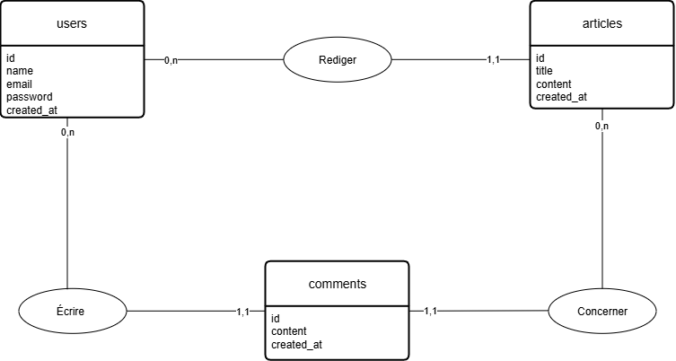
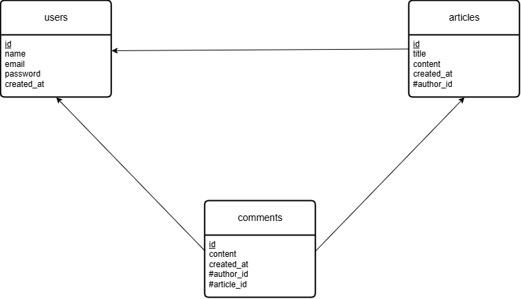
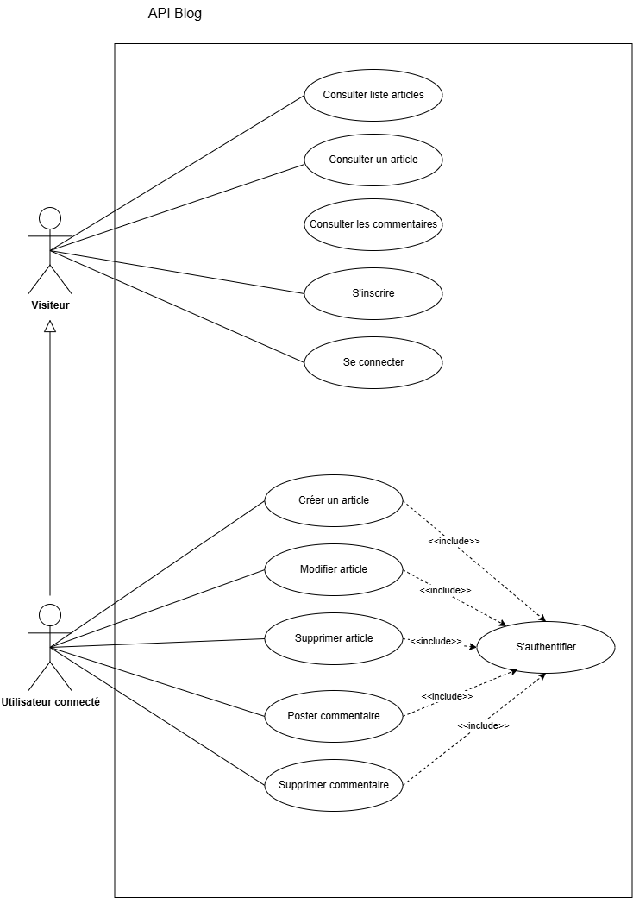

# Conception - API Blog

Ce document présente la conception de la base de données de l'API Blog,
depuis le modèle conceptuel jusqu'à la vérification de la normalisation.

## Modèle Conceptuel de Données (MCD)

Le MCD représente les entités et leurs associations, indépendamment
de toute technologie.

Trois entités principales :
- **users** : les utilisateurs de la plateforme
- **articles** : les articles publiés
- **comments** : les commentaires postés sur les articles

Les associations sont toutes de type un-à-plusieurs (1,n) :
- Un utilisateur peut rédiger plusieurs articles ; un article a un seul auteur.
- Un utilisateur peut écrire plusieurs commentaires ; un commentaire a un seul auteur.
- Un article peut recevoir plusieurs commentaires ; un commentaire concerne un seul article.

## Modèle Logique de Données (MLD)

Le MLD traduit le MCD en tables reliées par des clés étrangères.

## Modèle Relationnel (MR)

Représentation textuelle du modèle logique (clé primaire soulignée, # = clé étrangère) :

- **users** (<ins>id</ins>, name, email, password, created_at)
- **articles** (<ins>id</ins>, title, content, created_at, #author_id)
- **comments** (<ins>id</ins>, content, created_at, #author_id, #article_id)

## Diagramme de cas d'utilisation

Vue fonctionnelle : qui peut faire quoi dans le système.

Deux acteurs :
- **Visiteur** : peut consulter les articles et les commentaires, s'inscrire et se connecter.
- **Utilisateur connecté** : hérite des droits du visiteur, et peut en plus créer/modifier/supprimer ses articles et poster/supprimer ses commentaires.

Les actions de création, modification et suppression nécessitent une authentification
(relations « include » vers « S'authentifier »).

## Normalisation

Le modèle de données respecte les trois premières formes normales (3NF) :

- **1NF** : tous les attributs sont atomiques (une seule valeur par champ), et chaque table possède une clé primaire.
- **2NF** : chaque table utilise une clé primaire simple (`id` auto-incrémenté), donc tous les attributs non-clés dépendent de la totalité de la clé.
- **3NF** : aucun attribut non-clé ne dépend d'un autre attribut non-clé. Les informations liées (comme l'auteur d'un article) sont référencées par clé étrangère plutôt que dupliquées, évitant toute redondance.

Le modèle est donc normalisé, garantissant l'intégrité et la cohérence des données.